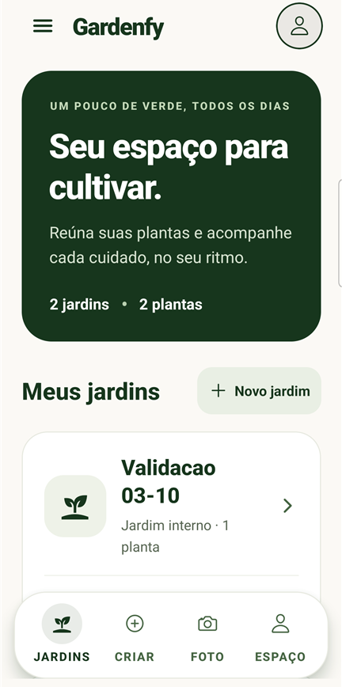
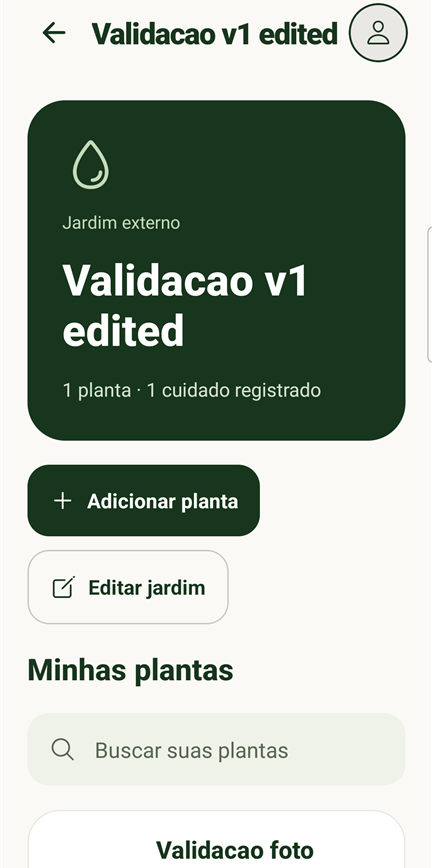
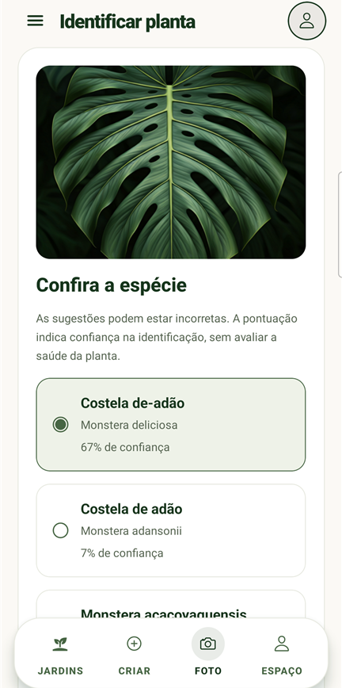

# 🌱 Gardenfy

Um pouco de verde, todos os dias. Organize seus jardins, conheça suas plantas e acompanhe cada rega e adubação.

[](https://github.com/NeytanBelisario/Gardenfy/releases/tag/v1.0.0-beta.1)
[](https://github.com/NeytanBelisario/Gardenfy/actions/workflows/checks.yml)

**[Baixar APK para testar](https://github.com/NeytanBelisario/Gardenfy/releases/download/v1.0.0-beta.1/Gardenfy-1.0.0-beta.1-android.apk)** · [Notas da versão](https://github.com/NeytanBelisario/Gardenfy/releases/tag/v1.0.0-beta.1)

Beta para Android 7 ou superior. O APK funciona sem Expo Go ou servidor de desenvolvimento. A versão estável 1.0 ainda está em preparação.

## O aplicativo

| Seus jardins | Suas plantas | Identificação por foto |
| :---: | :---: | :---: |
|  |  |  |

Capturas reais da validação no Android, com nomes de teste. [Sobre as imagens](docs/images/README.md).

## O que você pode fazer

- Criar e organizar jardins e plantas, com edição e exclusão.
- Adicionar plantas pelo catálogo ou identificar uma foto com Pl@ntNet, confirmando a espécie antes de salvar.
- Consultar orientações de luz, rega e substrato nas espécies com ficha disponível.
- Registrar regas e adubações e consultar ou corrigir o histórico.
- Usar jardins, catálogo e cuidados offline, com os dados salvos no aparelho.

Não há conta ou sincronização entre celulares. Identificar fotos exige internet; imagens remotas do catálogo podem não carregar offline. As orientações são informações da espécie: a foto não mede saúde, água ou luz. **Realidade aumentada: em breve.**

## Testar e contribuir

Instale o APK da beta e experimente criar um jardim, adicionar uma planta e registrar um cuidado. Feche e reabra o app para conferir seu histórico. Se encontrar um problema, [abra uma issue](https://github.com/NeytanBelisario/Gardenfy/issues/new) com os passos, modelo do celular e versão do Android. Evite incluir fotos ou informações pessoais.

Esta beta usa assinatura de avaliação. Captura nova de planta pela câmera, jornada com TalkBack e assinatura de produção continuam pendentes para a versão estável. [Validações e limites](docs/TESTING.md).

## Desenvolver

Expo 55 · React Native 0.83 · TypeScript · Supabase / Pl@ntNet

Use Node `22.22.2` e npm `10.9.7`:

```bash
git switch develop
npm ci
cp .env.example .env
npm start
```

Jardins e cuidados funcionam sem configurar o serviço de fotos. Para identificação, siga o [setup Pl@ntNet](docs/ANALYSIS.md#configurar-plantnet); chaves privadas ficam somente no servidor.

[Desenvolvimento](docs/DEVELOPMENT.md) · [Roadmap](docs/ROADMAP.md) · [Critérios da 1.0](docs/RELEASE_1.0.md) · [Continuidade](docs/HANDOFF.md) · [Regras do repositório](AGENTS.md)
